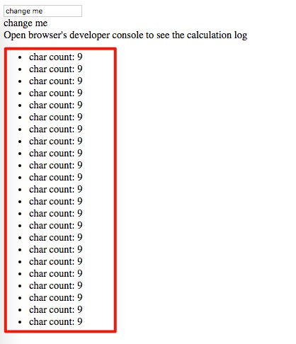
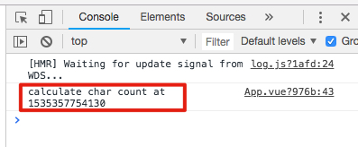

Vue Typescript Getter Calculated Once Demo
==========================================

The `getter` method in a vue component is calculated only once (that's good).

Display many times:



Only calculated once:



Run
---

```
npm install
npm run serve
```

Open browser's developer console, then change the content of the textfield, watch the log in developer console.